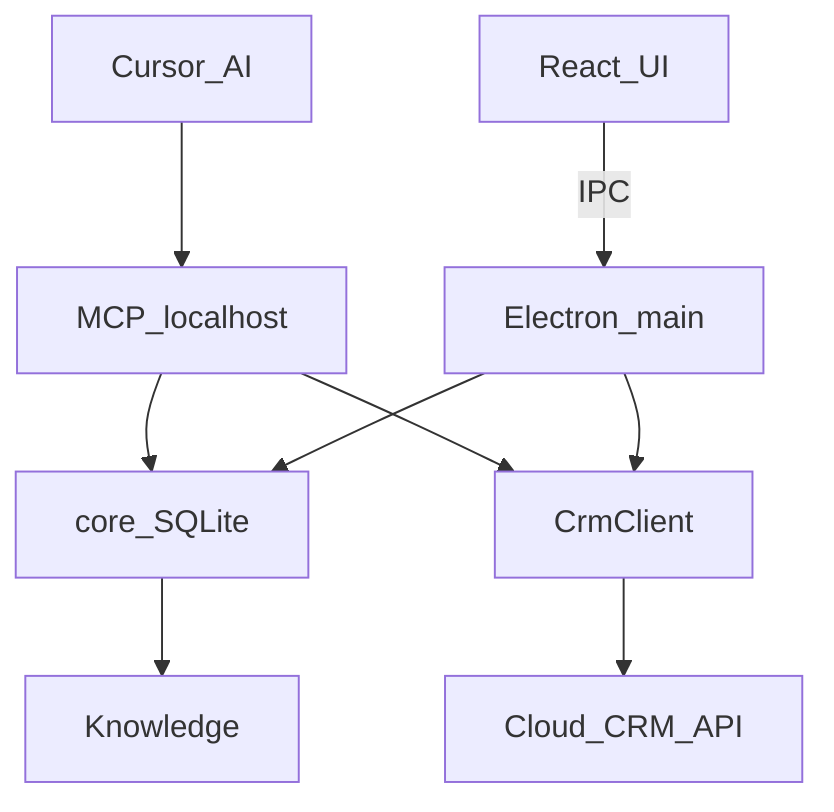

# 珠宝外贸业务员工作台：Electron + MCP

日期：2026-09-27

岗位：珠宝外贸业务员。本机工作台管每日记录、回复话术、个人回复习惯；客户等 CRM 数据从云端 API 读取。AI 通过 MCP 使用同一套数据。公司 CRM 不在本机重做。

## 目的

Windows 常驻 Electron 客户端，服务这三件事：

1. 每天下午提醒写入当日工作记录，次日 10:00 后把这条记录摆到首页。
2. 通过云端 API 获取客户等 CRM 数据，在工作台里查看，并让 AI 能读到。
3. 自建知识库：用户录入常用回复话术；系统收集并保存用户确认过的回复习惯，起草时一起用。

Cursor（含 Grok）在工作台开着时经本机 MCP 读写这些数据。Grok 网页不连本机，不当控制端。

## 架构

- `core`：唯一写本地库的地方。每日记录、话术、回复习惯、CRM 缓存、设置。
- `crm`：云端 API 适配器。界面和 MCP 都只经过它取客户数据。
- `electron`：托盘、定时提醒、窗口。渲染进程是 React。
- `mcp`：主进程在 `127.0.0.1` 抛出 MCP（Streamable HTTP）。工具只调 `core` 和 `crm`。

时区固定 `Asia/Shanghai`。提醒按本机本地钟，不按 UTC。

工作台没开时 HTTP MCP 不可用。第一期不做 stdio。

## 每日记录

一条记录对应一个本地日期 `YYYY-MM-DD`。一天一条。

字段：

- 跟进了哪些客户（可挂云端客户 id）
- 询盘、报价、样品、订单上的进展
- 今天没回完的事项
- 明天先做什么
- 自由备注

行为：

- 16:00：若当天记录未保存，托盘 Toast「写入今日工作记录」，点击打开记录页。
- 17:00：仍未保存则再提醒一次。16:00 前已保存则 17:00 不响。
- 保存后立刻进记录列表，可再改。
- 次日 10:00 起，首页置顶显示**昨天**这条记录，直到用户点「已查看」。
- 10:00 若昨天的记录还没被查看，托盘再提醒一次「查看昨日工作记录」。没有昨天的记录时，首页写「昨日未写记录」，不编造内容。
- 周末与工作日同一规则。以后若要跳过周末，再加设置。

MCP：

- `get_daily_record`：按日期，缺省今天
- `save_daily_record`：按日期覆盖保存
- `list_daily_records`：按日期范围

资源 `workbench://today`：今天是否已写、昨天的记录、是否已查看、今日待跟进。

## 云端 CRM

客户管理的主数据在云端。工作台不维护第二套客户主档。

`CrmClient`：

- `listCustomers`
- `getCustomer`
- 列表与详情做本机缓存，断网时界面和 MCP 标明「缓存」

设置页填写：Base URL、鉴权方式（Bearer 或自定义头）、超时。密钥只进用户数据目录。具体路径和字段映射等用户给出 API 文档后再定，适配器按文档改，MCP 工具名不变。

MCP：

- `list_customers` / `get_customer`：走 `CrmClient`，不把云端 token 返回给 AI

本机只存：客户 id 与每日记录、话术场景的关联。不提供写入公司 CRM 的工具。往公司系统补记录仍由用户在原系统完成；AI 可以按昨日记录和客户详情起草一段文字，工具名 `draft_crm_note`，只返回文本。

## 知识库

两层，都在本机 SQLite，都给起草用。

### 常用回复话术

用户自己录入、修改、停用。

- 场景：新询盘、报价、跟进、样品、PI/付款、交期、售后
- 标题、正文（可中英）、标签（材质、电镀、宝石、MOQ、交期等）
- 状态：启用 / 停用

MCP：`list_scripts`、`get_script`、`save_script`、`disable_script`

### 回复习惯

从用户明确标成「按这个记」的回复里收集，不从每一封草稿自动覆盖。

一条习惯：场景、结构说明（先问什么、报价怎么排、常用收尾）、例句、更新时间。用户可改、可删。

MCP：`list_reply_habits`、`save_reply_habit`、`delete_reply_habit`

### 检索

`search_knowledge`：按场景、客户、关键词返回启用中的话术和习惯。起草前 AI 先调这个，再写草稿。

资源 `workbench://knowledge`：启用话术数量、习惯条数、场景列表。

## MCP 抛出

主进程监听 `http://127.0.0.1:<port>/mcp`，只绑回环。本机 token，请求头 `Authorization: Bearer <token>`。设置页可复制 Cursor MCP 配置。无 token 拒绝。不监听局域网。不在渲染进程起服务。

发信类工具第一期不做。以后若接企业微信邮箱：`save_draft` 只存草稿，`request_send_draft` 必须在窗口里点发送。

## 界面

- 首页：10:00 后置顶昨日记录；今日记录入口；待跟进（来自云端客户 + 今日记录里点名的客户）
- 每日记录页
- 客户页：云端列表与详情，未配置 API 时说明缺配置，不显示假客户
- 知识库：话术、回复习惯
- 设置：MCP、云端 CRM、提醒时刻（默认 16:00、17:00、次日 10:00，可改时刻，规则不变）

托盘常驻。可选开机启动。

## 邮件

企业微信邮箱能否 IMAP 仍未确认。第一期邮件不是主路径。知识库和每日记录不依赖邮箱。确认可 IMAP 后再做只读同步和草稿；禁止爬企业微信网页。英文草稿的语法审校继续用 Cursor 技能 `trade-email-proofread`。

## 安全

- MCP 仅 localhost + token
- 云端 token、MCP token 不进 git，不出现在工具返回值里
- 不向云端 CRM 写数据
- 不自动发信

## 仓库

工作台单独仓库。本文件留在 `skills` 仓库作规格。Electron 工程不放进 `skills`。

## 分期

1. Electron 壳、每日记录、16:00 / 17:00 / 次日 10:00 提醒、这三条记录的 MCP
2. 话术与回复习惯、`search_knowledge`
3. `CrmClient` 接上用户提供的云端 API，客户页与 `list_customers` 走真数据
4. 邮箱只读与确认后发送（接口确认之后）

## 验收

- 当天未写记录时，16:00 与 17:00 各提醒一次；写过后 17:00 不提醒
- 次日 10:00 后首页显示昨天那条记录；点「已查看」后置顶消失，列表里仍在
- 未配置云端 API 时客户页不编造客户
- 配置 API 后，窗口和 MCP 看到同一批客户
- 话术可增改停用；回复习惯只在用户保存时写入
- `search_knowledge` 能按场景带回话术和习惯
- `draft_crm_note` 只返回文本
- 关掉 Electron 后 MCP 连不上
